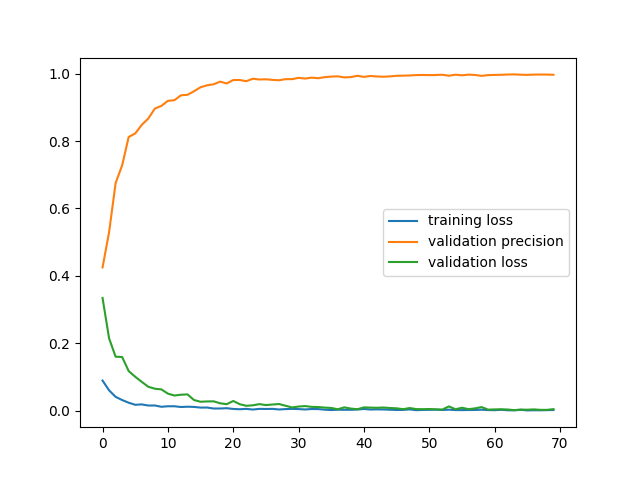

## Testing
### TLDR

To test the trained model stored in `model/trained.pt`, run

```
python3 evaluate.py -gpu
```

from the root directory, if you want to evaluate on GPU. Run

```
python3 evaluate.py -cpu
```

if you want to evaluate on CPU. I default the evaluation batch size to `512`. You can configure the batch size by

```
python3 evaluate.py -gpu/cpu --bsz <desired batch size>
```

### More Options

You can run

```
python3 evaluate.py -h
```
to see the configurable arguments.


## Training

Run
```
python3 train.py -gpu
```
or
```
python3 train.py -cpu
```
to train the Transformer model on gpu or cpu with default arguments. Run
```
python3 train.py -h
```
to see more configurable arguments.


## Tuning Choices

### Model
I initially experimented with GRU with a simple alignment attention mechanism (See `EncoderRNN` and `AttnDecoderRNN` in `model.py).
However, the model struggled to learn, predicting only the same toke over and over. I then turned to Transformer, hoping
that the more complex Tranformer would learn, and it did. The size of the Transformer is largely chosen to hit the under-5M-parameters target.
I experimented with many configurations before coming to conclusion that less layers and big hidden sizes achieved the best performance
under the parameter constraint.

The trained model has 3979555 trainable parameters.

### Hyperparameters

#### Batch Size
The polynomial expansion task calls for big batch sizes. I opted for 512.

#### Learning Rate
Before working on this challenge, I had experiences with fine-tuning BERT. The most common learning rate is `5e-4`, 
which is the learning rate I opted for.

#### When to Stop


<span class="caption">Training loss, validation loss, validation precision every 1000 batches. The x-axis spans 40 epochs*</span>

Based on the figure above, we decided that `40` epochs strikes a good balance between training time and performance, as the model has converged in 40 epochs. `40` epochs take 
about 4 hours to train on a GTX 1080 Ti, and achieves a precision above 99% on the validation set. If you wish to
train the model with a different number of epochs, use the `--n_epochs` flag to indicate your desired number of epochs when running
`python3 train.py`.


